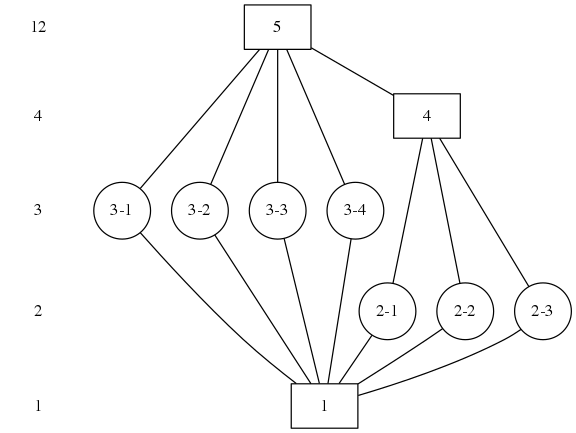

# Lagrange
> Is there a relation between the order of a group and that of a subgroup?

In this chapter {$$}G{/$$} will be a group, and {$$}H{/$$} will be a subgroup of
{$$}G{/$$}. The order of the group is the number of elements the group contains.
We want to investigate if there is a relation between the order of a group and
the order of a subgroup.

Let's first look at an example. We will examine the cyclic group {$$}C_{36}{/$$}
with 36 elements. We name its generator {$$}r{/$$}. Now take a look at the
element {$$}r^{6}{/$$}. We quickly find by explicit calculation that the
elements of the group generated by {$$}r^{6}{/$$} are

{$$}
\{ r^{6}, r^{12}, r^{18}, r^{24}, r^{30}, r^{36} = r^{0} = e \}
{/$$}

Which are six elements. Notice that 6 divides 36. Lagrange theorem tells is this
is always the case.

> ** Theorem _(Lagrange)_** For any group {$$}G{/$$} and subgroup {$$}H < G{/$$}
> the order of {$$}H{/$$} divides the order of {$$}G{/$$}.

We call the quotient the index of {$$}G{/$$} over {$$}H{/$$}, which we notate as
{$$}[G:H]{/$$}.

## Proof
We know that the cosets of {$$}H{/$$} partition {$$}G{/$$}. We will show a coset
{$$}uH{/$$} has the same number of number of elements as {$$}H{/$$}. We do this
by showing that the map {$$}\phi: H \rightarrow uH: h \mapsto uh{/$$} is bijective.

First, if {$$}\phi(g) = \phi(h){/$$}, i.e. {$$}ug = uh{/$$}, we have {$$}g =
h{/$$} by left cancellation of {$$}u{/$$}.

Second, let {$$}z \in uH{/$$}. There exist an {$$}h \in H{/$$} such that
{$$}z = uh{/$$}. Then {$$}\phi(h) = uh = z{/$$}, showing that {$$}\phi{/$$} is
surjective.

This shows that {$$}\phi{/$$} is bijective. From this Lagrange theorem follows.

## GAP
We will look at the alternating group {$$}A_{4}{/$$}.

```gap
a4 := AlternatingGroup(4);
```

The order of a4 is 12.

```gap
Order(a4);
```

GAP can calculate the lattice of subgroups for {$$}A_{4}{/$$} with the following
command, and show the conjugacy classes.

```gap
l := LatticeSubgroups(a4);
ConjugacyClassesSubgroups(l);
```



## Exercises
1. Prove that cycle groups of prime order can not have non-trivial subgroups.
2. Prove or disprove the converse of Lagrange theorem. I.e. if {$$}d{/$$} is a
   divisor of {$$}|G|{/$$}, {$$}G{/$$} has a subgroup of order d.
